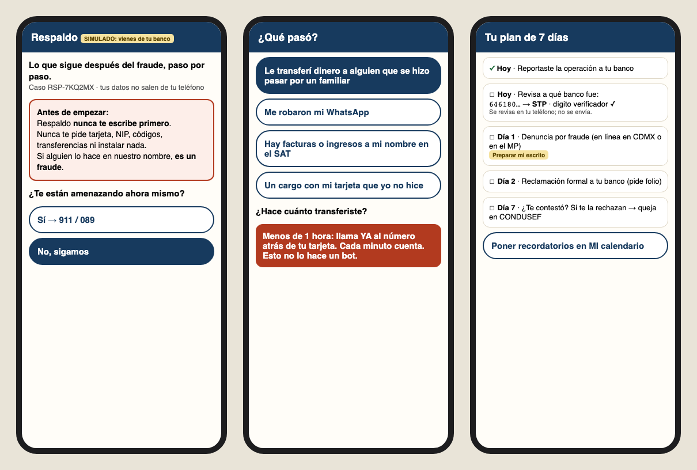
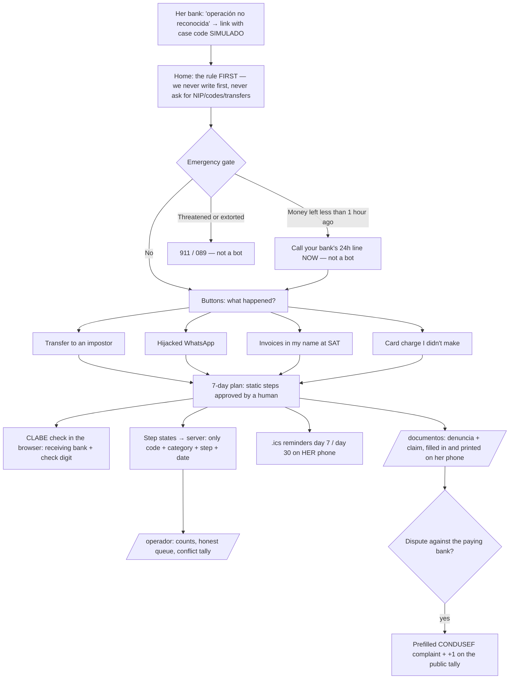
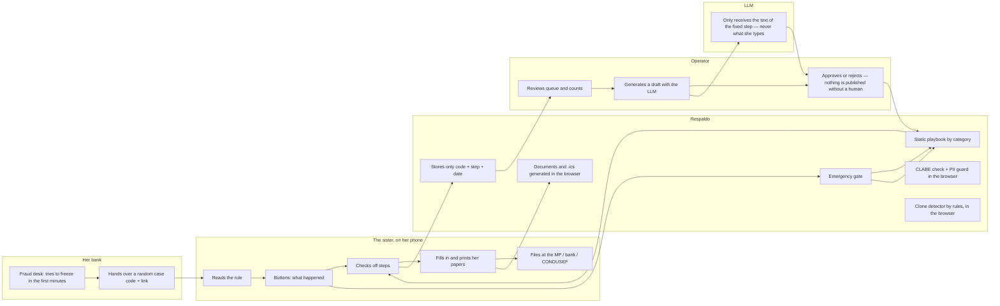

# Packet — w08-respaldo · "Respaldo: qué hacer después del fraude"

> Written BEFORE the code (course discipline). Week 8 · Chapter 7 "Quantum Genocide" · T3 · OPERATOR lens · Andrés Álvarez Morphy Namnum.
> **T3 Blueprint: pending.** The Team Bending session hasn't happened as I write this. The course allows building "the fused idea or their own surviving idea," and this slice is the one that survived nine rounds in my brief (breach-victim, re-scoped to an identity-fraud coach, section 4). When the Blueprint exists, the "Conditions → build" table gets updated against its conditions.

## The problem, in my words

A single attacker with an AI model took ~195M identity records from 10+ Mexican government bodies. That's more than the adult population, so for any Mexican the question "was I exposed?" has one answer: **assume yes.** What the leak feeds is **fraud with your own data**, and the fastest-growing case is WhatsApp: hijacks are up 650%. The hijacker writes from your brother's account, *"Hermana, emergencia, transfiéreme $8,000,"* and you send it by SPEI to a mule account.

What follows is an operating failure. **Five institutions, zero orchestrators.** Her bank, the Fiscalía (or the MP), CONDUSEF, WhatsApp and the phone company each own one piece. CONDUSEF says that in an SPEI transfer neither the sending nor the receiving bank is liable when the CLABE doesn't match the claimed beneficiary, so the loss stays with her. Nobody tells her the order, the papers, or the deadlines. She calls her bank three or four times asking "¿y ahora qué hago?", goes to the MP twice because she was missing a paper, and gives up silently.

**The trap my fight found:** every "helper" in this space becomes the next target. A site that answers "was your CURP leaked?" is an oracle extortionists can query about anyone. A helper that holds her documents is the next leak. A helper that writes to her can be cloned by recovery scammers at her most panicked minute.

## Exact user

- **The sister**: the person who sent the money, sent here by her own bank after the urgent report. Her first words: *"Le transferí 8,000 a mi hermano y no era él."*
- Persona for the synthetic test: **"Doña Lety Hernández,"** 58, sells tamales in Iztapalapa, has a BanCoppel account with the app, uses WhatsApp all day, reads slowly, distrusts anything that asks for data, and gives up silently when confused. *(Invented persona, built from the week's research; not a real person.)*
- **Second actor:** her brother **Toño**, whose WhatsApp was stolen. He gets a forwardable flow.
- **Third actor:** the **operator** at the bank's contact center or at Respaldo, who answers the queue and approves the playbook text.

## Definition of success

**Before the module closes**, at the live URL, with no account:
1. She arrives "from her bank" (a SIMULADO deep link with a bank-issued case code) and reads, before anything else, the rule: **we never write first and never ask for a card, NIP, codes, transfers, or installs.**
2. On `/caso`, using **buttons only**, she picks what happened. An emergency gate sends what moves in minutes to her bank's line or 911/089 **before** any checklist.
3. She gets a **7-day plan** in the right order, with the "why" for each step. She checks steps off, and the states stay on her phone.
4. She types the CLABE she transferred to, and **in her browser** she sees which bank receives it and whether the number is well formed. That's the bank she should name in her claim. The CLABE never leaves her phone.
5. On `/documentos` she fills in and prints the **denuncia** and her **bank claim / CONDUSEF complaint** **without anything leaving her phone**, which an automated test proves.
6. She downloads **calendar reminders** (.ics) for day 7 and day 30. They're her phone's reminders, not our messages.
7. On `/es-real` she pastes a message that says it's from "Respaldo" and the app tells her **it's a clone**, according to the rules, without sending the text anywhere.
8. On `/operador` the operator sees the **real count** of step states by code (not by person), the **honest queue** (live range, viral-Tuesday simulator) and the **public conflict tally**.
9. On `/operador/redactar`, the operator generates a plain-language draft of a playbook step with the LLM, and it is **never published without human approval**.

## Mockup (generated)

*Generated by code (HTML → Playwright) before writing the app, as in weeks 4–7: the class19 team's free AI Gateway doesn't give access to image generation.*

## Flow

## Benchmark

**The best existing solution in the world for this is** the UK system: **Stop Scams 159** (one number that can't be spoofed and puts you through to your own bank's fraud line; 1M+ calls) plus the **mandatory APP-scam reimbursement** of the PSR (since 7-Oct-2024, up to £85k, split 50/50 between the sending and receiving bank; 97% of in-scope claims reimbursed). Spain's **INCIBE 017** is the operator model (138k contacts in 2025, half of them reactive). **Mine differs/localizes in that** Mexico has neither the short number nor the reimbursement: CONDUSEF says that in an SPEI transfer the banks aren't liable when the CLABE doesn't match, so the work falls on the victim. Respaldo makes that work shorter, **without holding her identity and without ever writing first** (in Mexico the hijack epidemic runs on WhatsApp, and the second wave is a fake "helper").

## Long view (3 sentences)

See `CHARTER.md`. In short: in three years, the after-fraud coach every bank links from its "operación no reconocida" screen, shared through the ABM. When Mexico copies the UK's reimbursement rule, the step-completion data, which records steps and no identities, becomes the evidence banks need. The walls never move: hold no identity, never write first, complaints against the payer always public.

## Scope cut (what I'm NOT building this week)

- **No "were you exposed?" lookup** by CURP, email or phone. That's a design decision, not a lack of time.
- **No integration with a real bank.** The deep link and the case code are **SIMULADO** and labeled.
- **No WhatsApp Business API.** Meta's business verification takes weeks, and the web works on any phone.
- **No sending** of any document. Everything gets printed or saved on her phone; she files it herself.
- **No runtime LLM for the victim.** The model only drafts for the operator.
- **No legal advice.** The papers are models with blanks; the screen says to check with the institution.
- **Simulated operator data** (queue, tally) is labeled. Step counts are real, from whatever happens at the URL.

## Conditions → how the build honors them

*T3 Blueprint pending. Meanwhile, these are the conditions from my brief (sections 4–5) and the fight.*

| Condition (brief) | How |
|---|---|
| 1. Holds state, not identity | The server only accepts `{codigo, categoria, paso, estado}` with enums and a code regex; it adds `fecha`. Personal-data fields don't exist in the API. Documents and the CLABE live in the browser. |
| 2. Never writes first, not even follow-ups | No email/SMS/WhatsApp sending. The only "reminder" is a `.ics` she downloads to her calendar. |
| 3. The rule before the first click | The home page and every screen of the case show the "nunca te escribimos primero / nunca te pedimos…" box. |
| 4. The model never reads what she types | Triage is buttons. `/api/redactar` only accepts a `pasoId` from the playbook catalog; the text sent to the model comes out of the catalog, not the request. |
| 5. Coach, not agent | No "we file it for you." She prints and files. |
| 6. What moves in minutes isn't the bot's | Emergency gate before the plan: money < 1 h → her bank; threats → 911/089. |
| 7. Conflict with the payer → CONDUSEF + public tally | Step "the bank rejected my claim" → prefilled CONDUSEF complaint + tally counter on `/operador`. |
| 8. Honest queue | `/operador` computes a range from the real clear rate; the viral-Tuesday simulator shows the backlog in weeks, not a promise. |

## Dragon stack (multiplies, doesn't add)

**LLM** (drafts of the playbook for the operator, AI Gateway; SIMULADO fallback labeled) × **security tooling** (CLABE validation with the `clabe-validator` library: format, check digit and receiving bank; PII guard by regex; rule-based clone detector; CSP and security headers) × **automation** (denuncia and claim generated in the browser, `.ics` calendar, step counts). The LLM makes the playbook readable for Doña Lety. The security tooling keeps her data on her phone and spots the clone. The automation turns the plan into papers and reminders she owns. Take the tooling away and the LLM becomes a leak. Take the automation away and it's a PDF.

## Architecture and stack

| Layer | Choice | Why |
|---|---|---|
| Framework | Next.js 15 (App Router, JS) + Tailwind 4 | course template |
| Playbook | `lib/playbook.js`: 4 categories, static steps with source and "why" | reviewable text, identical for everyone |
| Security in the browser | `clabe-validator` (MIT), `lib/pii.js` (CURP/RFC/CLABE/card/phone), `lib/clon.js` (rules) | nothing leaves the phone |
| Documents | `lib/documentos.js` → HTML with print CSS | free, no server |
| Calendar | `lib/ics.js` (RFC 5545) | reminders on HER phone |
| Persistence | Vercel Blob: one immutable JSON per step state `{codigo, categoria, paso, estado, fecha}` | no personal data → no auth; validated enums |
| LLM | AI SDK + Vercel AI Gateway → `google/gemini-2.5-flash-lite` (the class19 free tier returns 403 for Anthropic models; tested 2026-10-01); labeled SIMULADO fallback; guards for added/dropped numbers | free; the human approves |
| Headers | CSP, `Referrer-Policy: no-referrer`, `X-Frame-Options: DENY`, `Permissions-Policy` | security week: the bar starts at home |
| Hosting | Vercel (team `class19`) | |

## Security floor

1. **Secrets:** `BLOB_READ_WRITE_TOKEN` only in Vercel env vars; `.env*` in `.gitignore`. 2. **Auth:** doesn't apply; nothing personal gets stored, and the screen says exactly what does (`/reglas`). 3. **RLS:** doesn't apply (no Supabase). 4. **Validation:** code `^RSP-[A-HJ-NP-Z2-9]{6}$`, category and step from a closed catalog, state `hecho|pendiente`; JSON body ≤ 1 KB; `/api/redactar` with a per-IP limit. 5. **Invented data:** the persona, the demo codes and the operator data are invented and labeled.

## Test plan

**Mechanical** (`node --test` over `lib/` + Playwright against production at 390 px):
- a) `validarCLABE`: a valid CLABE → bank name; a bad check digit → "the number is wrong"; letters or 17 digits → rejected.
- b) `detectarPII`: catches a CURP, RFC, CLABE, 16-digit card number and 10-digit phone number; doesn't flag "8,000".
- c) `esClon`: "Hola, soy de Respaldo, para recuperar tu dinero dame el código que te llegó" → clone (writes first + asks for a code); a neutral text → "no rules matched, still: we never write first."
- d) `colaHonesta(300, 2 humans, 30 min, 15 new/day)` → a range in weeks, not "9 days."
- e) `ics()` produces a valid VCALENDAR with two VEVENTs and no personal data.
- f) The API rejects an extra field (`nombre`), a bad code, and a category outside the catalog; the stored JSON has exactly 5 keys.
- g) **E2E privacy:** on `/documentos`, type an invented name and RFC, generate the papers, and confirm that **no network request carries them** (Playwright intercepts every request).
- h) `/caso` at 390 px without horizontal scroll; the emergency gate comes before the plan.

**Persona:** Doña Lety walks through home → case → documents → is-it-real from screenshots; every confusion gets logged and the worst one gets fixed before the deadline.
